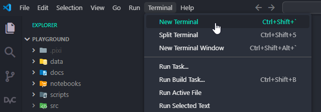
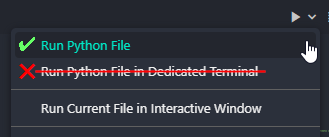
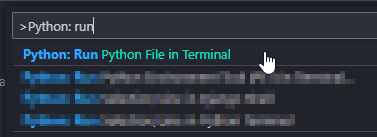
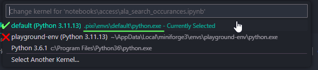
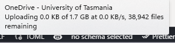

# Pixi for Python environments

## Introduction

`pixi` is a multi-language, cross-platform package manager that aims to harmonise `conda` and `pypi` packages in a single project. It's super fast, project-first, [Python Software Foundation (PSF)](https://packaging.python.org/en/latest/specifications/pyproject-toml/#pyproject-toml-spec) compliant, and can be installed in the user-space (admin not required). It's the love child of [uv](https://docs.astral.sh/uv/) and `conda`, making it ideal for writing code for geospatial analysis. In fact, the developers use [GDAL as an example](https://pixi.sh/latest/python/tutorial/) of why `pixi` is useful.

> 🔗 [Home | Why pixi? - Pixi by prefix.dev](https://pixi.sh/latest/#why-pixi)

## Prerequisites

- [ ] TODO: Prerequisites for pixi usage
  - [ ] MAYBE: git

## Installation (Win11)

1. Open the Windows Terminal app
2. Run the installation script from the `pixi`:
   `powershell -ExecutionPolicy ByPass -c "irm -useb https://pixi.sh/install.ps1 | iex"`
3. Relaunch Windows Terminal (or open a new tab)
4. Update `pixi`:
   `pixi self-update`

> 🔗 [Installation - Pixi by prefix.dev](https://pixi.sh/latest/installation/)

## Initialising projects

> ⚠️ Gotcha: [Project root directory location](#project-root-directory-location)
>
> **Do not** save your project inside OneDrive

1. Open your project/repo folder in VS Code
2. Open a new `vscode` terminal window
   `Menu bar > Terminal > New Terminal`
   
3. In the `vscode` terminal window use the `pixi init` command to initialise the folder

   ```powershell
   # initialise with pyproject manifest and github configs
   pixi init --format pyproject --scm github

   # as above, but import the environment from a yaml
   pixi init --format pyproject --scm github -i path/to/environment.yaml
   ```

4. This will create a project manifest file in the project directory
5. Open up the `pyproject.toml` to have a look
6. Proceed to [Using the environment](#using-the-environment) for steps on adding or removing dependencies.

> ‼️ Always commit the `pyproject.toml` and `pixi.lock` to GitHub

> 🔗 [Basic Usage - Pixi by prefix.dev](https://pixi.sh/latest/python/tutorial/)

## Using the environment

> ⚠️ Gotcha: [Project-centric workflow](#project-centric-workflow)

### Adding/removing project dependencies

1. Navigate your terminal to your project root
   `cd ../path/to/my-project`
2. Add packages to the environment using `pixi add`
   1. By default `pixi` uses the `conda-forge` package index:
       `pixi add geopandas`
   2. If a package is only available on `pypi` package index:
       `pixi add --pypi galah-python`
3. Remove packages from the environment using `pixi remove`
   `pixi remove geopandas`

> ‼️ conda vs. pypi dependencies
>
> Open up the `pyproject.toml` to see what `pixi` has changed.
>
> Where are the `conda` packages specified? Where are the `pypi` dependencies specified?

### Activating the environment

> ⚠️ Gotcha: [UTAS ITS Managed Devices](#utas-its-managed-devices)

1. Install the environment:
   `pixi install`
2. Activate the environment:
   `pixi shell`
3. You can now run the tools you have installed in the environment via the terminal.

```powershell
# run a script with python
python my_script.py

# use a cli tool
gdalinfo my_image.tif
exiftool my_image.tif

```

### Running scripts

#### (Option 1): via terminal

1. Activate your environment [as above](#activating-the-environment)
2. Get the file path of your script file
   e.g. Open `vscode` explorer panel and find your script file: `Right Click > Copy Relative Path`
3. Call Python and give it your script (+ arguments if required)
   `python /path/to/my_script.py arg1 arg2`

#### (Option 2): via `vscode`

1. Activate your environment
2. Click the small chevron next to the "Play" icon in the top right corner of the window and select "Run Python File"

   

   Or via the Command Palette (`Ctrl + Shift + P`)

   
3. The script will be run using the active terminal window with the correct environment scope.

### Running Notebooks

#### via `vscode`

1. Open your Jupyter Notebook file (`.ipynb`) in `vscode`
2. Select the Notebook Kernel
   1. Open the Command Palette and search for: `Notebook: Select Notebook Kernel`
   2. Select the one named `(default)` that will have a file path starting with `.pixi/`
   
3. Use your notebook like normal
4. The kernel must be selected/activated for each notebook

#### via JupyterLab

1. Navigate to your project root in the terminal
   `cd /path/to/my-project`
2. If `jupyterlab` is not installed in the environment, install it
   `pixi add jupyterlab`
3. Launch `jupyterlab`
   `pixi run jupyter lab`

> 🔗 [JupyterLab - Pixi by prefix.dev](https://pixi.sh/latest/integration/editor/jupyterlab/)

## Gotchas

### Project-centric workflow

> ⏩ TL;DR
>
> For project-centric workflows (i.e. `pixi`):
>
> - `conda` and `pixi` approach environments in fundamentally different ways
> - `pixi` operates relative to the project root; `conda` operates globally
> - `pixi` expects the project manifest to be in the project root (`../my-project/pyproject.toml`)
> - `conda` and `pixi` can be installed and used on the same system if required
> - **Do not** save `pixi`-based repos in OneDrive

The Python developers introduced `pyproject.toml` [specification](https://packaging.python.org/en/latest/specifications/pyproject-toml/#pyproject-toml-spec) aimed to modernise and standardise the way Python projects were defined. The specification requires a *project-centric* approach, where tools and environments are managed relative to the project *root* directory.  While this approach is more aligned to modern software dev practices, it was not compatible with the *environment-centric* approach of the `conda` ecosystem. Developers had to choose between a huge repository of cross-platform `conda` packages, or producing a PSF compliant project. `pixi` aims to bring a project-centric approach to the `conda` ecosystem that is compliant with modern Python standards.

The key benefits of a project-centric approach are that project's manifest (metadata), requirements (dependencies), and environment are all located inside the project directory alongside the source code. Additionally, project environments are **self documenting** and **version controlled** in the project manifest (`pyproject.toml`) and lockfile (`pixi.lock`). These files are automatically generated, maintained, and validated by `pixi` which greatly minimises the risk of an environment drifting or becoming corrupted.

> 🔗 [Switching from Conda/Mamba - Pixi by prefix.dev](https://pixi.sh/latest/switching_from/conda/#key-differences-at-a-glance)

### Global environments with `pixi`

Although it is possible to create global environments with `pixi`, they are not functionally equivalent to `conda` environments. It is recommended that `pixi` is used with the project-centric approach.

> 🔗 [Global Tools | Creating a Data Science Sandbox Environment - Pixi by prefix.dev](https://pixi.sh/dev/global_tools/introduction/#creating-a-data-science-sandbox-environment)

### Project root directory location

It is common for Python environments to be large in both size (GBs) and number of files (tens to hundreds of thousands of files). We also just learned that `pixi` installs the environment into the project root folder.

It is **strongly recommended** that you **do not** save your projects inside OneDrive (or any desktop sync service) if you are using `pixi`. Not only is it useless to sync an environment (envs aren't transferable), but your sync service will get jammed up syncing the files and cause endless sync conflicts.

Best practice is to work from your home directory: `C:\Users\user.name\projects\my-project`

Trust me on this one… it's not worth it.



### UTAS ITS managed devices

ITS has blocked all scripts on UTAS Windows devices which is known to cause problems for activating `pixi` environments. It also stops `conda` and `mamba` from initialising in PowerShell.

If you run `pixi shell` (or any command) and encounter this message:

```text
PS C:\Users\user.name\projects\playground> pixi shell
File C:\Users\user.name\AppData\Local\Temp\.tmpzNMwa7.ps1 cannot be loaded because running scripts is disabled on this system.
For more information, see about_Execution_Policies at https:/go.microsoft.com/fwlink/?LinkID=135170.
    + CategoryInfo          : SecurityError: (:) [], ParentContainsErrorRecordException
    + FullyQualifiedErrorId : UnauthorizedAccess
```

Set the execution policy for **the current terminal session** temporarily by running:

`Set-ExecutionPolicy RemoteSigned -Scope Process`

This will not persist between terminal sessions. Run it again as needed.
